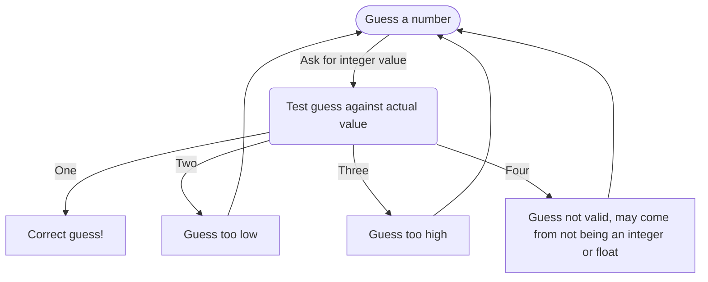

```mermaid
flowchart TD
    A([Guess a number]) --> |Ask for integer value| B(Test guess against actual value)

    B --> |One| C[Correct guess!]

    B --> |Two| D[Guess too low]
    D --> A

    B --> |Three| E[Guess too high]
    E --> A

    B --> |Four| F[Guess not valid, may come from not being an integer or float]
    F --> A
```

